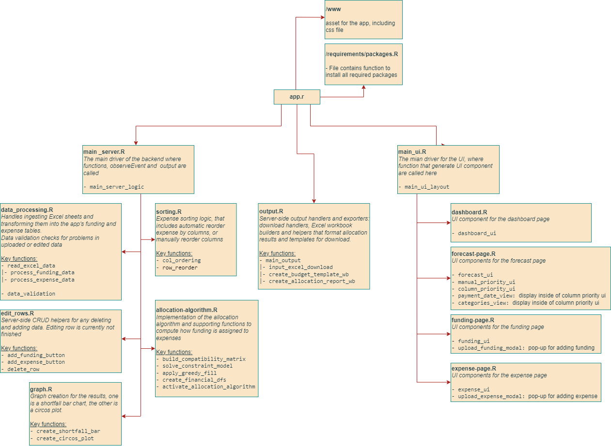

# WEHI Forecasting with Workdays Project

---

## Table of Contents

[1. Quick Links](#1-quick-links)

[2. Getting Started](#2-getting-started)

[3. Usage](#3-usage)

[4. Project Structure](#4-project-structure)

[5. Project Evolution](#5-project-evolution)

[6. Resources & Documentation](#6-resources--documentation)

---

## 1. Quick Links

- Live Demo: [link]
- Fast Track report [link](https://wehieduau.sharepoint.com/:w:/r/sites/StudentInternGroupatWEHI/Shared%20Documents/Forecasting%20Budget/2025%20Summer/Presentation%20and%20Formal%20Reports/Fast-track%20Report.docx?d=we00883216ea24fa7aa48c4a65b73be05&csf=1&web=1&e=cKiZhd)
- Final Report powerpoint [link]


---

## 2. Getting Started

### 2.1 Prerequisites

You will need **R** (version 4.4.1) and **RStudio** installed on your machine.

**R Installation Links**
-   [**Download R**](https://cran.r-project.org/)
-   [**Download RStudio**](https://posit.co/download/rstudio-desktop/)

### 2.2 Installation

1.  **Clone the repository:**

    ``` bash
    git clone https://github.com/narolinelim/forecasting-with-workday-project.git
    ```

2.  **Run the app**

    Open the `app.R` file in RStudio. There is no need to install any additional packages as all required packages are included in the code.

    Click **Run App** or run:

    ``` bash
    shiny::runApp("path/to/your/app.R")
    ```

---

## 3. Usage

1.  **Upload the Master Spreadsheet** - The Master Spreadsheet contains all the necessary data for forecasting, including funding sources and expenses. In this version, the user will upload the Master Spreadsheet into the app to initiate the forecasting process.

2.  **Select the priority level** - Select the priority level for the forecast. The priority level determines how funds are allocated to expenses based on their importance.

3.  **Generate the forecast** - Generate the forecast based on the uploaded Master Spreadsheet and selected priority level. The app will process the data and provide a forecast of funding allocation and expenses.

4.  **Download the foretasted results in Dashboard** - After generating the forecast, the user can download the results in the Dashboard section of the app. The results will be available in an Excel format.

---

## 4. Project Structure

### 4.1 Overview

This repository contains the codebase for the WEHI Forecasting with Workdays Shiny application. This is a proof of concept that streamlines the process of updates and finalisaiton for budget forecasting, ensuring that the forecast is consistent and systematic.
The app accepts a Master Spreadsheet as input, processes the data, and generates a forecast based on user-defined priority levels. 

### 4.2 Modules

#### 4.2.1 Directory Structure
```
├── README.md                             # Overview, setup and usage
├── app.R                                 # App launcher 
├── requirements/
│   └── packages.R                        # Dependency checks / install helper (was requirements/packages.R)
├── www/                                  # Static assets: images, css, js
└── src/
    ├── main_ui.R                         # Main UI layout and page wiring
    ├── main_server.R                     # Main server wiring (main_server_logic + module sourcing)
    ├── server/                           # Server-side modules (business logic)
    │   ├── allocation-algorithm.R        # Allocation engine (optimizer + helpers)
    │   ├── data-processing.R             # Read/clean Excel and validation routines
    │   ├── edit-rows.R                   # CRUD helpers for funding & expense rows
    │   ├── sorting.R                     # Sorting and reordering logic
    │   ├── graph.R                       # Plot creation (shortfall, circos/chord)
    │   └── output.R                      # Download handlers and Excel builders
    └── ui/                               # UI component files
        ├── forecast-page.R               # Forecast page UI and components
        ├── funding-page.R                # Funding management UI (forms / tables)
        ├── expense-page.R                # Expense management UI (forms / tables)
        └── dashboard-page.R              # Dashboard page UI and components
```

#### 4.2.2 Module Structure Diagram

The diagram below illustrates the structure and interaction of the various modules within the application. The modules sturcture as `module A ---> module B` indicates that `module A` calls function(s) in `module B`.



Diagram is updated as of 31/01/2025

#### 4.2.3 Values Callouts

How to call variables across modules:
- `input$variable_name` - Access input values from UI components.
- `output$variable_name` - Define output values to be rendered in the UI.
- `values (reactiveValues)` - Store and manage reactive values that can be shared across modules.
    - `values$variable_name` - Access or modify reactive values.

Each component should have a ID defined in the UI and server modules that will be used as `variable_name` in the above calls.

### 4.3 Code Guidelines

#### 4.3.1 Naming Conventions

- **Use descriptive names for variables and functions**
Variables and functions should have clear and descriptive names that indicate their purpose. Generic names like `df` or `temp` should be avoided. For special cases where generic names are used, comments should be added to clarify their purpose and how it can be used.

- **Consistent naming style**
Use a consistent naming style throughout the codebase. In this project, we use `snake_case` for variable and function names (e.g., `calculate_forecast`, `user_input_data`).

#### 4.3.2 Functions

The function should have a clear purpose and a clear description of what it does. Each function should have a docstring that describes its purpose, input parameters, and return values.

Example:
```r
function_name <- function(param1, param2) {
    #' Function description and explaination
    #' 
    #' @param param1 Description of param1
    #' @param param2 Description of param2
    #' 
    #' @return Description of the return value

    # Function logic here
    return(result) # Explixit return statement
}
```

The function should explicity return a value using the `return()` statement, rather than relying on implicit returns in R for better readability and maintainability. 

---

## 5. Project Evolution

### Current Workflow

1.  **Data Input** - The user inputs funding sources and expenses.
    - User can upload a Master Spreadsheet containing all necessary data for forecasting.
    - User can also manually add/delete funding sources and expenses through the app interface.
2.  **Data Processing** - The app processes the uploaded data, cleaning and validating it for forecasting.
3.  **Priority Selection** - The user selects the priority level for the forecast.
    - Column priorities: Sort the expenses based on user-defined columns.
    - Manual priorities: User can manually reorder expenses to set their priorities.
4.  **Forecast Generation** - The app generates the forecast based on the processed data and selected priority level.
5.  **Results Output** - The user can download the forecasted results in Excel format

### Possible Future Improvements

- Better high level understanding through interacting with the intended users to gather feedback and improve usability.
- Editing capabilities for funding sources and expenses directly within the app.
- PDF report generation for forecast summaries.
- Improvement on the adding and deleting of funding sources and expenses to make it more intuitive.
- Deployment of the app on a cloud platform for testing.

---

## 6. Resources & Documentation

### 6.1 Handbooks

- [**User Manual (Web App Workflow)**](https://wehieduau.sharepoint.com/:w:/r/sites/StudentInternGroupatWEHI/Shared%20Documents/Forecasting%20Budget/Summer%202025-2026/PRESENTATION%20AND%20FORMAL%20REPORTS/User%20Manual.docx?d=w7c8aa2a0ff304e09bc794a126d1b848f&csf=1&web=1&e=wTcszP)

- [**Admin Manual (Local Setup)**](https://wehieduau.sharepoint.com/:w:/r/sites/StudentInternGroupatWEHI/_layouts/15/Doc2.aspx?action=editNew&sourcedoc=%7B518bb466-6083-474b-8832-eb06cbc1d9f4%7D&wdOrigin=TEAMS-MAGLEV.teamsSdk_ns.rwc&wdExp=TEAMS-TREATMENT&wdhostclicktime=1770083024171&web=1)

### 6.2 Project Background

- [**Project Folder**](https://wehieduau.sharepoint.com/:f:/r/sites/StudentInternGroupatWEHI/Shared%20Documents/Forecasting%20Budget/Summer%202025-2026?csf=1&web=1&e=1UrsrQ)

- [**Wireframe**](https://www.figma.com/design/3MiVeEfBgM1ZnFrgMnojyG/Draft_UI-UX?node-id=47-752)

- [**Technical Diaries**](https://wehieduau.sharepoint.com/:f:/r/sites/StudentInternGroupatWEHI/Shared%20Documents/Forecasting%20Budget/Summer%202025-2026/TECHNICAL%20DIARY?csf=1&web=1&e=lY055g)

- [**Individual Learning Plans**](https://wehieduau.sharepoint.com/:f:/r/sites/StudentInternGroupatWEHI/Shared%20Documents/Forecasting%20Budget/Summer%202025-2026/ILP?csf=1&web=1&e=bSyhLj)

### 6.3 Future Enhancements

- [**Possible Future Improvements**](https://wehieduau.sharepoint.com/:w:/r/sites/StudentInternGroupatWEHI/_layouts/15/Doc2.aspx?action=editNew&sourcedoc=%7B8ea9208e-5a0e-44ea-83bb-65b2af95cee1%7D&wdOrigin=TEAMS-MAGLEV.teamsSdk_ns.rwc&wdExp=TEAMS-TREATMENT&wdhostclicktime=1770084328500&web=1)

  
---
